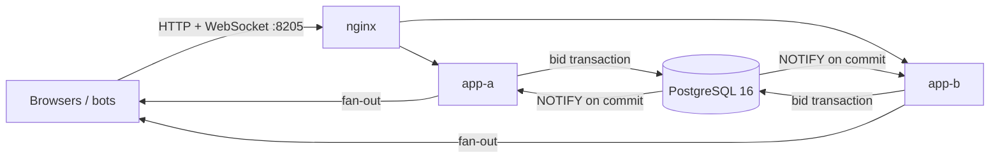

# live-auction

A real-time auction service. Bids arrive over WebSockets, are decided inside PostgreSQL transactions under optimistic locking (a pessimistic `SELECT ... FOR UPDATE` strategy ships beside it for comparison), push the end time out when they land inside the anti-sniping window, and reach every subscriber in order, including subscribers connected to a different application instance. Every bid attempt gets exactly one definitive answer, and a load test is written to check that no accepted bid is lost.

[](https://github.com/mgeladzerezo/live-auction/actions/workflows/ci.yml)

Stack: Java 25, Spring Boot 4.1.1, PostgreSQL 16 with Flyway, raw `WebSocketHandler` with a small JSON protocol, vanilla ES-module UI, Micrometer/Prometheus.

## Architecture



Both instances run the same code, including the lifecycle scheduler. A bid accepted on one instance reaches the sockets held by the other through PostgreSQL `LISTEN/NOTIFY`.

## Quick start

```
docker compose up --build
```

Open <http://localhost:8205>. Four demo lots are seeded, open immediately and are re-created some seconds after each one finishes. Register an account (top right), open a lot, bid, and press "Simulate crowd" to have five bot bidders compete with you. The header shows which instance your socket landed on. Metrics are at `/actuator/prometheus`. Postgres is exposed on host port 5545.

Without Docker: start a PostgreSQL 16 with a database `auction` (user and password `auction`) on port 5545, then `./mvnw spring-boot:run`. Settings are overridable by environment: `DB_URL`, `DB_USER`, `DB_PASSWORD`, `PORT`, `BID_STRATEGY` (`optimistic` or `pessimistic`), `INSTANCE_ID`, `DEMO_ENABLED`.

REST, for curl: `POST /api/auth/register|login`, `GET /api/auctions`, `GET /api/auctions/{id}`, `POST /api/auctions`, `POST /api/auctions/{id}/bids` (`{"amount":12500,"clientBidId":"abc"}`, amounts in minor units), `GET /api/auctions/{id}/audit`.

## How it works

### 1. Placing a bid
[`BidLedger`](src/main/java/io/github/mgeladzerezo/auction/bid/BidLedger.java) runs one bid attempt as one transaction: read the auction row together with the database clock, let the pure function [`BidRules`](src/main/java/io/github/mgeladzerezo/auction/bid/BidRules.java) decide, then write. Acceptance updates the auction row (`WHERE version = ?`), inserts the attempt, the bid and the events, all or nothing. The [two strategies](src/main/java/io/github/mgeladzerezo/auction/bid) differ only in how they make the read still be true at write time:

- **Optimistic** reads without a lock and relies on the version predicate. If the row moved, the attempt rolls back and retries after a jittered exponential backoff ([`Backoff`](src/main/java/io/github/mgeladzerezo/auction/bid/Backoff.java)), at most `maxAttempts` times, then answers `CONTENTION`. Retries re-read the new state, so a loser of a race usually becomes a plain `TOO_LOW` on the next read rather than a second conflict.
- **Pessimistic** reads with `FOR UPDATE`. Bids on one auction queue on the row lock and never conflict.

Why optimistic is the default: on a hot auction most bids are rejected (they are too low by the time they are decided), and a rejection needs no write to the auction row. Under optimistic locking those rejections never touch the row lock, so they do not queue behind the bids that do. Under pessimistic locking every attempt, accepted or not, waits for the row lock while holding a pooled connection, so a hot auction can drain the pool for everyone else. The cost of optimistic is wasted work: attempts that lose the version race are rolled back and repeated, and the share of attempts that do so is expected to grow with the number of concurrent writers on one row. The bounded retry count caps that cost per bid. How large the effect is on this code is exactly what the load test below is meant to measure; no figure is claimed here.

A per-instance fair semaphore (`auction.bidding.max-concurrent`, default 12) keeps bid transactions below the connection pool size, so waiting bidders are parked virtual threads instead of a queue inside Hikari that would also block the scheduler and snapshot reads.

**Idempotency.** `bid_attempts` has primary key `(bidder_id, client_bid_id)`. The insert is `ON CONFLICT DO NOTHING`; on conflict the transaction rolls back and the stored answer is returned with `duplicate: true`. A re-sent bid can never become a second bid, and the table is what lets the load test check that every attempt has exactly one answer.

**Whose clock.** All deadline decisions (is the bid in time, is the auction due to close, does it extend) use `clock_timestamp()` / `statement_timestamp()` inside the SQL statement. Application instances disagree with each other by milliseconds to seconds; the database is the one clock every transaction already talks to, and it is the one that orders the commits. [`DbClock`](src/main/java/io/github/mgeladzerezo/auction/config/DbClock.java) is an estimate used only for the countdown offset and lag metrics, never for a decision.

**Append-only history.** `bids`, `bid_attempts` and `auction_events` have triggers that reject UPDATE and DELETE. The auction row's price, leader, bid count and deadline are denormalised; [`ConsistencyAudit`](src/main/java/io/github/mgeladzerezo/auction/auction/ConsistencyAudit.java) re-derives them from the bid history, and settlement refuses to finalise an auction that fails it.

### 2. Anti-sniping and closing
A bid accepted with no more than `anti_snipe_window_seconds` left adds one window to `ends_at`, up to `max_extensions` times. The extension is part of the same `UPDATE` as the bid, so there is no moment where a bid is accepted and the deadline has not moved. The event stream carries a `TIME_EXTENDED` event.

[`AuctionLifecycle`](src/main/java/io/github/mgeladzerezo/auction/auction/AuctionLifecycle.java) opens, closes and settles auctions. Each transition claims its auctions with `pg_try_advisory_xact_lock`, so several instances share the work, and applies a guarded `UPDATE ... WHERE status = 'OPEN' AND ends_at <= statement_timestamp()`. The close and a last-instant bid both need the row lock, so one goes first: if the bid commits an extension first, PostgreSQL re-checks the close's `WHERE` against the new row and the close does nothing; if the close goes first it bumps `version`, so an optimistic bid matches no row and a pessimistic bid sees `CLOSED`, and either way the bid is rejected. The Javadoc on the class also explains why `FOR UPDATE SKIP LOCKED` was rejected: it skips rows locked by bidders, so under pessimistic bidding the closer could skip the very auction it had to close.

### 3. Real-time delivery
The wire protocol is documented on [`AuctionSocketHandler`](src/main/java/io/github/mgeladzerezo/auction/realtime/AuctionSocketHandler.java): `SUBSCRIBE {auctionId, lastSeq?}`, `BID`, `PING`; the server answers with `WELCOME` (instance, server time), `SNAPSHOT`, `REPLAY`, `BID_RESULT`, and the events `AUCTION_OPENED`, `BID_ACCEPTED`, `TIME_EXTENDED`, `AUCTION_CLOSED`, `AUCTION_SETTLED`. Each event has a per-auction sequence number allocated by the same `UPDATE` that changes the auction, so sequence order is commit order. Clients detect a gap, re-subscribe with `lastSeq`, and get a replay (or a fresh snapshot if too far behind).

[`EventStore.append`](src/main/java/io/github/mgeladzerezo/auction/event/EventStore.java) writes the event row and calls `pg_notify` in the bid's transaction. PostgreSQL delivers a notification only if the transaction commits, so "broadcast only after commit" is a property of the database. [`NotificationListener`](src/main/java/io/github/mgeladzerezo/auction/event/NotificationListener.java) holds one dedicated `LISTEN` connection per instance and feeds the [`AuctionHub`](src/main/java/io/github/mgeladzerezo/auction/realtime/AuctionHub.java). There is deliberately no local shortcut, so single-instance and clustered deployments run the same path; a periodic sweep heals lost notifications.

Each socket has a bounded outbox ([`ClientConnection`](src/main/java/io/github/mgeladzerezo/auction/realtime/ClientConnection.java)) written by its own virtual thread. Producers only `offer`; a full queue closes that connection as a slow consumer and the client reconnects with `lastSeq`. A slow client cannot block the bidding path. Auth is an opaque bearer token (stored hashed), passed as `?token=` on the handshake because browsers cannot set headers on a WebSocket.

## Design decisions

- **Raw WebSocket instead of STOMP.** The protocol needs per-auction ordering, a replay by sequence number and one answer per client bid id. STOMP would add a broker abstraction that has to be bypassed to guarantee those, and its subscription model does not carry `lastSeq`.
- **LISTEN/NOTIFY instead of polling an events table.** Lower latency and no polling load. Costs: notifications are not queued for a disconnected listener (hence the event log and the resync on reconnect) and a payload limit of 8000 bytes (events are small; `append` refuses larger ones). Under NOTIFY, commits that notify are serialised by PostgreSQL, which bounds write throughput; this was not measured.
- **Attempt ledger separate from the bids table.** Rejections need a durable, idempotent answer too, so `bid_attempts` records every definitive answer and `bids` only the accepted ones, with a foreign key between them.
- **Money is `BIGINT` minor units** everywhere, including the UI contract.
- **Advisory locks for the scheduler** rather than `SKIP LOCKED`, for the reason given above.
- **Not done:** proxy (automatic) bidding with a maximum amount, the optional extension. The bots in the demo are plain bidders.

## Testing

| Test | What it proves |
|---|---|
| `bid/BidRulesTest`, `bid/BackoffTest` | Bid rules (closed, leader, increment, extension window and cap) and backoff bounds as pure functions. |
| `bid/BiddingIntegrationTest` | Both strategies against real PostgreSQL: accept/reject reasons, idempotent retry, anti-sniping in the same transaction, append-only triggers. |
| `bid/ConcurrencyRaceTest` | Latch-forced interleavings: close versus last-instant bid, extension versus close, two bids on one version, for both strategies. |
| `auction/LifecycleIntegrationTest` | Open/close/settle transitions, audit blocking settlement on corrupted data, concurrent schedulers. |
| `realtime/*Test`, `RealtimeIntegrationTest` | Subscription ordering, snapshot and replay, gap handling, slow-consumer policy, protocol errors, over a real socket. |
| `realtime/TwoInstanceTest` | A bid accepted on one application instance reaches a subscriber on another. |
| `ApiIntegrationTest` | REST and auth. |
| `load/BidStormSmokeTest` | 200 concurrent WebSocket bidders, per strategy, on every build; checks the invariants below. |
| `load/BidStormLoadTest` | The same with 1,000 bidders, behind the `load` profile. |

The storm tests, using the JDK `java.net.http.WebSocket` client on virtual threads against the real application and a Testcontainers PostgreSQL, with duplicate sends and dropped connections injected, assert afterwards: every attempt got exactly one answer (and identical answers on re-send); the attempt ledger equals what clients sent; the accepted bids seen by clients are exactly the rows of `bids`; accepted amounts are strictly increasing and respect the increment; final price and winner equal the last accepted bid; no accepted bid is timestamped after the final end time; the extension count re-derived from bid timestamps equals the stored one; every subscriber saw the same gap-free event sequence; and the server-side audit is clean. The 1,000-bidder run requires at least one extension in total, so a run that never reached the anti-sniping window is reported as inconclusive rather than passing.

```
./mvnw -B verify                       # everything except the 1,000-bidder run
./mvnw -B -Pload verify                # 1,000 bidders, both strategies, heap raised to 1.5 GB
./mvnw -B -Pload -Dstorm.strategies=optimistic verify   # one strategy
```

The load run writes `target/storm-comparison.txt` and a report per strategy in `target/`.

### Load-test results

The claim "no bid is lost under 1,000 concurrent bidders" is what `BidStormLoadTest` is designed to prove. **It has not been executed in a verified state for this README, so it is not stated here as a proven result.** The table below is deliberately empty; fill it from `target/storm-comparison.txt`.

| Strategy | Attempts | Answered/s | Accepted/s | p50 ms | p99 ms | Conflicts per attempt |
|---|---|---|---|---|---|---|
| optimistic | not yet measured | | | | | |
| pessimistic | not yet measured | | | | | |

Any figures should be quoted with the hardware, and with the caveat that the load generator and the application share one JVM and one machine.

## Known limitations

- **Verification status.** The test suite in its final form has **not been executed**. The only full `mvn verify` run (98 tests, all passing) was made against the commit "load test with concurrent WebSocket bidders", before the demo seeder, the UI, the Docker files and later fixes were added; that result does not cover them. The 1,000-bidder profile was run a few times during development with varying outcomes on a heavily loaded machine; no figures from those runs are recorded in this repository and none are claimed.
- The Dockerfile, `docker-compose.yml`, nginx configuration and CI workflow were **not built or started to completion in a verified state**. An earlier manual bring-up showed both instances healthy behind nginx and a bid on one instance delivered to sockets on both, but the final Dockerfile and nginx changes were not re-run.
- The UI was only looked at as headless screenshots of the list and one auction page; the bid form, login dialog, extension flash and reconnect behaviour were not exercised in a browser.
- The demo seeder and crowd simulator have no automated tests.
- Proxy bidding is not implemented.
- The anti-sniping window and extension limit of demo lots are fixed in `DemoSeeder`.
- Load-test figures depend heavily on what else the machine is doing; the generator shares the JVM with the application.
- `/api/demo/auctions/{id}/crowd` needs a login but is otherwise unthrottled beyond a small cap on concurrent crowds.
